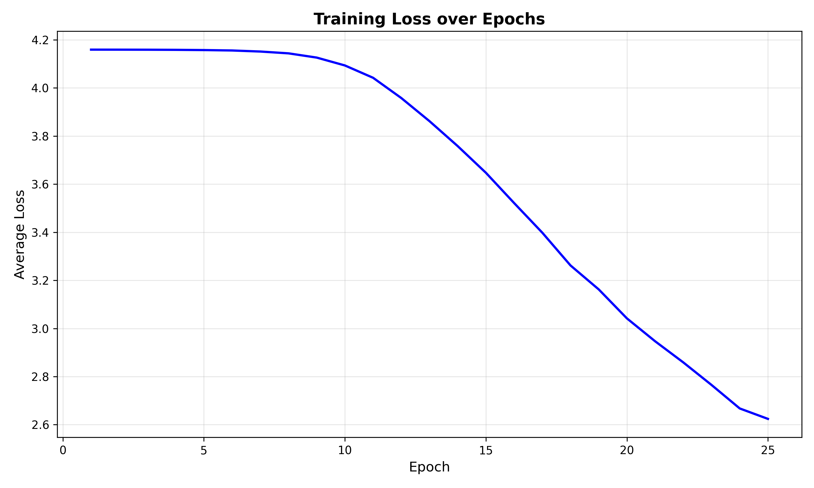
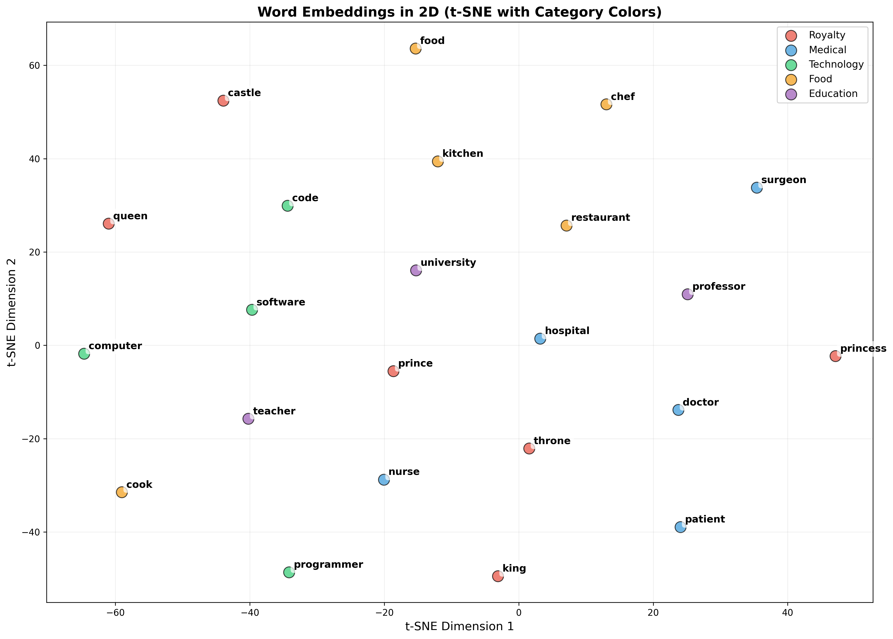

# Word2Vec Implementation

Skip-gram model with negative sampling implemented in pure NumPy.

## Files

- **word2vec.py**: Contains the SkipGram model class and Vocabulary helper class
- **train.py**: Training script with example corpus and training loop
- **visualize.py**: Generates visualizations including loss plots, word analogies, and 2D embeddings
- **requirements.txt**: Python dependencies
- **model/**: Folder containing saved model files created by train.py (model_data.npz, vocab.pkl)
- **visualizations/**: Folder containing generated plots

## Dataset

The model is trained on a corpus of 48 sentences across different topics (186 unique words total). The dataset includes distinct semantic categories:

- **Royalty**: king, queen, prince, princess, castle, throne
- **Medical**: doctor, nurse, hospital, patient, surgeon
- **Technology**: programmer, computer, software, code, engineer
- **Food**: chef, cook, restaurant, meals, kitchen
- **Education**: teacher, student, school, professor, university
- **Arts**: artist, painter, musician, painting, music
- **Sports**: athlete, football, team, game, championship
- **Weather**: rain, sun, winter, snow, weather

Example sentences:
```
the king rules the kingdom with wisdom
the queen sits on the throne beside the king
the doctor examines the patient carefully
the programmer writes code on the computer
a chef cooks delicious food in the kitchen
students study hard for exams
```

This diverse dataset helps the model learn clearer word relationships based on context and semantic categories.

## Usage

Train the model:
```bash
python train.py
```

Generate visualizations:
```bash
python visualize.py
```

This creates visualizations in the `visualizations/` folder:
- `loss_plot.png`: Training loss over epochs
- `embeddings_2d.png`: 2D t-SNE projection of word embeddings with color-coded categories
- Semantic relationship tests printed to console

## Visualizations and Discussion

Let us discuss the visualizations of the results. These results can be reproduced by running both the commands in [Usage](#usage)

The training loss decreases over 25 epochs (from ~4.16 to ~2.62), demonstrating successful learning.



**Semantic Relationship Tests**: Computes cosine similarity between word pairs to verify the model learned semantic relationships. Due to the small dataset, all pairs show very high similarity (>0.99), though within-domain pairs are slightly higher than cross-domain pairs.

```
Word 1          Word 2          Similarity   Category
-----------------------------------------------------------------
king            queen           0.9984       Royalty pair
king            prince          0.9942       Royalty family
doctor          hospital        0.9983       Medical domain
doctor          nurse           0.9965       Medical professionals
programmer      computer        0.9940       Tech domain
chef            cook            0.9926       Food professionals
king            doctor          0.9967       Cross-domain
programmer      chef            0.9928       Cross-domain
```

**2D Embeddings with t-SNE**: t-SNE projects 50-dimensional vectors into 2D space. Words are color-coded by category (Royalty=red, Medical=blue, Technology=green, Food=orange, Education=purple), making it easy to see that semantically similar words cluster together.



**Note**: The 2D plot shows words relatively evenly spaced rather than forming tight clusters. This is because with only 48 training sentences, all word similarities are extremely high (>0.99), the embeddings haven't formed distinct semantic regions yet. Words are likely learning general co-occurrence patterns rather than specialized topic clusters. If trained on a larger dataset, you would see clear separate clusters for each category. 

This even spacing is to be expected with such a small amount of data.